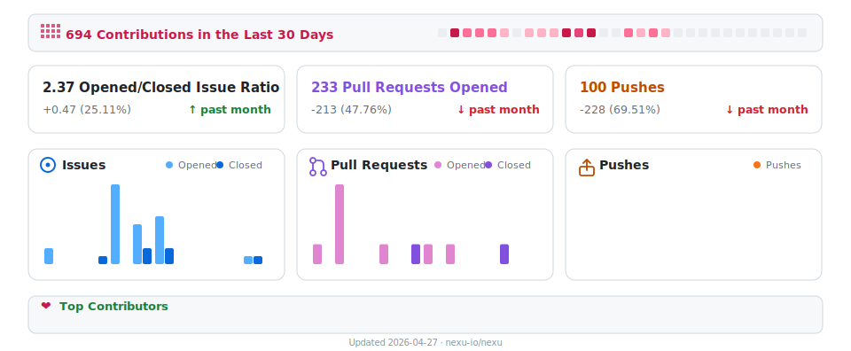

<p align="center">
  
</p>

<h1 align="center">nexu</h1>

<p align="center">
  <strong>가장 간단한 오픈소스 OpenClaw 🦞 데스크톱 클라이언트 — WeChat &amp; Feishu 지원</strong>
</p>

<p align="center">
  <a href="https://github.com/nexu-io/nexu/releases"></a>
  <a href="https://github.com/nexu-io/nexu/blob/main/LICENSE"></a>
  <a href="https://github.com/nexu-io/nexu/stargazers"></a>
</p>

<p align="center">
  <a href="https://nexu.io" target="_blank" rel="noopener"><strong>🌐 공식 사이트</strong></a> &nbsp;·&nbsp;
  <a href="https://docs.nexu.io" target="_blank" rel="noopener"><strong>📖 문서</strong></a> &nbsp;·&nbsp;
  <a href="https://github.com/nexu-io/nexu/discussions"><strong>💬 Discussions</strong></a> &nbsp;·&nbsp;
  <a href="https://github.com/nexu-io/nexu/issues"><strong>🐛 Issues</strong></a> &nbsp;·&nbsp;
  <a href="https://x.com/nexudotio" target="_blank" rel="noopener"><strong>𝕏 Twitter</strong></a>
</p>

<p align="center">
  <a href="README.md">English</a> &nbsp;·&nbsp; <a href="README.zh-CN.md">简体中文</a> &nbsp;·&nbsp; <a href="README.ja.md">日本語</a> &nbsp;·&nbsp; 한국어
</p>

---

> 🦞 **WeChat × OpenClaw을 가장 매끄럽게 연결**: 스캔하고 바로 연결, 즉시 사용 가능.
>
> 🖥 **지원 플랫폼**: macOS (Apple Silicon) · macOS (Intel) · Windows — [다운로드](https://powerformer.feishu.cn/wiki/IWQZwt1qSiExq7kfioWcI1qVnFf)
>
> 🎉 **베타 혜택**: 베타 기간 동안 Gemini 등 최상위 모델을 **무료로** 사용할 수 있습니다. [지금 다운로드 →](https://nexu.io)

---

## 📋 nexu란?

**nexu** (next to you)는 **OpenClaw 🦞** Agent를 WeChat, Feishu, Slack, Discord 등의 IM에서 직접 실행할 수 있는 오픈소스 데스크톱 클라이언트입니다.

WeChat + OpenClaw 지원 — WeChat 8.0.7 OpenClaw 플러그인과 호환됩니다. 연결을 클릭하고, WeChat으로 스캔하면 AI Agent와 채팅을 시작할 수 있습니다.

다운로드 후 바로 사용 — 그래픽 설정, 내장 Feishu Skills, 다중 모델 지원 (Gemini 등), 자체 API 키 사용 가능.

IM에 연결하면 Agent가 24시간 온라인 — 스마트폰에서 언제 어디서나 채팅할 수 있습니다.

모든 데이터는 사용자의 기기에 저장됩니다. 프라이버시는 완전히 사용자가 관리합니다.

<h3 align="center">🎬 제품 데모</h3>

<p align="center">
  <video src="https://github.com/user-attachments/assets/d7a801e4-6d0c-40f2-aa0c-d28fd78fdcaa" width="100%" autoplay loop muted playsinline>
    브라우저가 동영상 재생을 지원하지 않습니다. <a href="https://github.com/user-attachments/assets/d7a801e4-6d0c-40f2-aa0c-d28fd78fdcaa">동영상 다운로드</a>하여 시청하세요.
  </video>
</p>

---

## 📊 다른 솔루션과의 비교

| | OpenClaw (공식) | 일반적인 호스팅 Feishu + 에이전트 구성 | **nexu** ✅ |
|---|---|---|---|
| **🧠 모델** | 직접 가져올 수 있지만 수동 설정 필요 ⚠️ | 플랫폼 고정, 전환 불가 ❌ | **Gemini 등 선택 — GUI에서 원클릭 전환; MiniMax / Codex / GLM OAuth 지원** ✅ |
| **📡 데이터 경로** | 로컬 | 벤더 서버를 경유, 데이터 통제 불가 ❌ | **로컬 우선; 비즈니스 데이터를 호스팅하지 않음** ✅ |
| **💰 비용** | 무료지만 직접 배포 필요 ⚠️ | 구독 / 좌석별 과금 ❌ | **클라이언트 무료; 자체 API 키로 프로바이더에 직접 결제** ✅ |
| **📜 소스** | 오픈소스 | 클로즈드 소스, 감사 불가 ❌ | **MIT — 포크하여 감사 가능** ✅ |
| **🔗 채널** | 직접 연동 필요 ⚠️ | 벤더에 따라 다름, 종종 제한적 ❌ | **WeChat, Feishu, Slack, Discord 내장 — 바로 사용 가능** ✅ |
| **🖥 인터페이스** | CLI, 기술 지식 필요 ❌ | 벤더에 따라 다름 | **순수 GUI, CLI 불필요, 더블 클릭으로 시작** ✅ |

---

## 기능

### 🖱 더블 클릭으로 설치

다운로드하고 더블 클릭하면 바로 사용할 수 있습니다. 환경 변수, 의존성 문제, 긴 설치 문서가 필요 없습니다. nexu는 첫 실행부터 모든 기능을 갖추고 있습니다.

### 🔗 내장 OpenClaw 🦞 Skills + 전체 Feishu Skills

네이티브 OpenClaw 🦞 Skills와 전체 Feishu Skills를 함께 제공합니다. 추가 연동 없이도 팀이 이미 사용하는 실제 워크플로에 Agent를 바로 투입할 수 있습니다.

### 🧠 최상위 모델, 즉시 사용

nexu 계정을 통해 Gemini 등을 바로 사용할 수 있습니다. 추가 설정 불필요. 언제든 자체 API 키로 전환 가능합니다.

### 🔐 OAuth 로그인, 키 불필요

MiniMax, OpenAI Codex, GLM (Z.AI Coding Plan)은 OAuth 로그인 지원 — 원클릭 인증, API 키 복사-붙여넣기 불필요.

### 🔑 자체 API 키 사용, 로그인 불필요

자체 모델 프로바이더를 선호하시나요? API 키를 추가하면 계정 생성이나 로그인 없이 클라이언트를 사용할 수 있습니다.

### 📱 IM 연결, 모바일 지원

WeChat, Feishu, Slack, Discord에 연결하면 스마트폰에서 즉시 AI 에이전트를 사용할 수 있습니다. 별도 앱 불필요 — WeChat이나 팀 채팅을 열어 이동 중에도 에이전트와 대화하세요.

### 👥 팀을 위한 설계

핵심은 오픈소스이며, 실제로 작동하는 데스크톱 경험을 제공합니다. 팀이 이미 신뢰하는 도구와 모델 스택과 호환됩니다.

---

## 사용 사례

nexu는 **1인 기업**과 소규모 팀을 위해 만들어졌습니다 — 한 사람, 하나의 AI 팀.

### 🛒 1인 이커머스 / 해외 무역

> *"3개 국어로 상품 설명을 작성하는 데 주말 내내 걸렸습니다. 이제는 Feishu에서 Agent에게 제품 스펙을 알려주면, 커피 한 잔 마시는 동안 Amazon, Shopee, TikTok Shop 리스팅이 완성됩니다."*

상품 조사, 경쟁사 가격 비교, 리스팅 최적화, 다국어 마케팅 자료 — 일주일 분량을 하루 오후로 압축.

### ✍️ 콘텐츠 크리에이터 / 지식 블로거

> *"월요일 아침: Slack에서 Agent에게 이번 주 트렌드를 물어봅니다. 점심 전에 Xiaohongshu, WeChat, Twitter용 초안 5개가 나옵니다 — 각 플랫폼에 맞는 톤으로."*

트렌드 추적, 주제 생성, 멀티 플랫폼 콘텐츠 제작, 댓글 관리 — 혼자서 콘텐츠 매트릭스를 운영.

### 💻 인디 개발자

> *"새벽 3시 버그 추적? Discord에 스택 트레이스를 붙여넣으면, Agent가 레이스 컨디션까지 추적하고, 수정 방안을 제안하고, PR 설명까지 작성해 줍니다. 잠들지 않는 페어 프로그래밍."*

코드 리뷰, 문서 생성, 버그 분석, 반복 작업 자동화 — Agent가 페어 프로그래밍 파트너입니다.

### ⚖️ 법률 / 금융 / 컨설팅

> *"클라이언트가 Feishu로 40페이지 계약서를 보냅니다. Agent에게 전달하면 — 10분 후 리스크 요약, 주의 조항, 수정 제안을 받습니다. 반나절이 걸리던 일이 커피 한 잔 시간으로."*

계약 검토, 규정 조회, 보고서 작성, 클라이언트 Q&A — 전문 지식을 Agent 스킬로 전환.

### 🏪 로컬 비즈니스 / 소매

> *"자정에 고객이 '이거 재고 있나요?'라고 메시지를 보냅니다. Feishu의 Agent가 실시간 재고로 자동 응답하고, 반품 처리까지 하고, 프로모션 쿠폰까지 보냅니다. 이제 드디어 잘 수 있습니다."*

재고 관리, 주문 추적, 고객 메시지 자동 응답, 마케팅 문구 — AI가 매장 운영을 도와줍니다.

### 🎨 디자인 / 크리에이티브

> *"Slack에 간단한 브리프를 올립니다: '반려동물 사료 브랜드 랜딩 페이지, 활발한 분위기.' 킥오프 미팅 전에 카피 옵션, 컬러 팔레트 제안, 참고 이미지가 돌아옵니다."*

요구사항 분석, 자료 검색, 카피라이팅, 디자인 주석 — 창작 시간을 확보하고 반복 작업을 줄입니다.

---

## 🚀 시작하기

### 시스템 요구사항

- 🍎 **macOS**: macOS 12+ (Apple Silicon & Intel)
- 🪟 **Windows**: Windows 10+
- 💾 **저장 공간**: 약 500 MB

### 설치

**빌드된 클라이언트 (권장)**

| 플랫폼 | 다운로드 |
|--------|----------|
| 🍎 macOS (Apple Silicon) | [공식 사이트](https://nexu.io) · [Releases](https://github.com/nexu-io/nexu/releases) |
| 🍎 macOS (Intel) | [다운로드](https://powerformer.feishu.cn/wiki/IWQZwt1qSiExq7kfioWcI1qVnFf) |
| 🪟 Windows | [다운로드](https://powerformer.feishu.cn/wiki/IWQZwt1qSiExq7kfioWcI1qVnFf) |

### 첫 실행

nexu 계정으로 로그인하면 지원 모델에 즉시 액세스할 수 있으며, 자체 API 키를 추가하여 계정 없이도 사용할 수 있습니다 🔑.

---

## 🛠 개발

### 사전 요구사항

- **Node.js** 22+ (LTS 권장)
- **pnpm** 10+

### 저장소 구조 (발췌)

```text
nexu/
├── apps/
│   ├── api/              # Backend API
│   ├── web/              # Web frontend
│   ├── desktop/          # Desktop client (Electron)
│   └── controller/       # Controller service
├── packages/shared/      # Shared libraries
├── docs/
├── tests/
└── specs/
```

### 명령어

```bash
pnpm run dev             # Dev stack with hot reload
pnpm run dev:desktop     # Desktop client
pnpm run build           # Production build
pnpm run lint
pnpm test
```

---

## 🤝 기여하기

기여를 환영합니다! 영문 전체 가이드는 저장소 루트의 [CONTRIBUTING.md](CONTRIBUTING.md)에 있습니다 (PR 작성 시 GitHub에 표시됨). 동일한 내용이 [docs.nexu.io — Contributing](https://docs.nexu.io/guide/contributing)에도 게시되어 있습니다. **중문:** [docs.nexu.io (zh)](https://docs.nexu.io/zh/guide/contributing) · [docs/zh/guide/contributing.md](docs/zh/guide/contributing.md).

1. 🍴 이 저장소를 포크
2. 🌿 기능 브랜치 생성 (`git checkout -b feature/amazing-feature`)
3. 💾 변경 사항 커밋 (`git commit -m 'Add amazing feature'`)
4. 📤 브랜치에 푸시 (`git push origin feature/amazing-feature`)
5. 🔀 Pull Request 열기

### 가이드라인

- 기존 코드 스타일을 따르세요 (Biome; `pnpm lint` 실행)
- 새 기능에 대한 테스트를 작성하세요
- 필요에 따라 문서를 업데이트하세요
- 커밋은 원자적이고 설명적으로 유지하세요

---

## ❓ FAQ

**Q: nexu는 무료인가요?**
A: 클라이언트는 완전 무료이며 오픈소스(MIT)입니다. 여러 최상위 모델이 내장되어 있으며, 자체 API 키를 사용할 수도 있습니다.

**Q: 어떤 운영체제를 지원하나요?**
A: macOS 12+ (Apple Silicon & Intel)와 Windows 10+를 지원합니다.

**Q: 어떤 IM 플랫폼을 지원하나요?**
A: WeChat, Feishu, Slack, Discord가 내장되어 있으며 바로 사용할 수 있습니다.

**Q: 데이터는 안전한가요?**
A: 모든 데이터는 사용자의 기기에 저장됩니다. nexu는 비즈니스 데이터를 호스팅하지 않습니다. 소스 코드는 오픈되어 감사 가능합니다.

**Q: 자체 API 키를 사용할 수 있나요?**
A: 네. API 키를 추가하면 계정 생성이나 로그인 없이 사용할 수 있습니다.

**Q: WeChat에 연결하려면 무엇이 필요한가요?**
A: nexu는 WeChat 8.0.7 OpenClaw 플러그인과 호환됩니다. 연결을 클릭하고, WeChat으로 스캔하면 됩니다 — 추가 설정 불필요.

---

## 💬 커뮤니티

GitHub을 커뮤니티 소통의 주요 플랫폼으로 사용합니다. 새 스레드를 열기 전에 기존 항목을 검색하여 중복을 방지해 주세요.

| 채널 | 용도 |
|------|------|
| 💡 [**Discussions**](https://github.com/nexu-io/nexu/discussions) | 질문, 아이디어 제안, 사용 사례 공유 등. **Q&A** 카테고리에서 문제 해결, **Ideas**에서 기능 브레인스토밍. |
| 🐛 [**Issues**](https://github.com/nexu-io/nexu/issues) | 버그 보고 또는 기능 요청. Issue 템플릿을 사용해 주세요. |
| 📋 [**Roadmap & RFCs**](https://github.com/nexu-io/nexu/discussions/categories/rfc-roadmap) | 향후 계획을 팔로우하고 설계 토론에 참여. |
| 📧 [**support@nexu.ai**](mailto:support@nexu.ai) | 비공개 문의, 파트너십 등. |

### 커뮤니티 그룹 참여

<table>
  <tr>
    <td align="center" width="220">
      <strong>💬 WeChat 그룹</strong><br/><br/>
      <br/>
      <sub>스캔하여 WeChat 커뮤니티 참여</sub>
    </td>
    <td align="center" width="220">
      <strong><a href="https://applink.feishu.cn/client/chat/chatter/add_by_link?link_token=8b7k7b5b-ac27-4748-9165-78606dc16913">🪁 Feishu 그룹</a></strong><br/><br/>
      <br/>
      <sub>스캔 또는 클릭하여 Feishu 커뮤니티 참여</sub>
    </td>
    <td align="center" width="220">
      <strong><a href="https://discord.gg/Q6AxCUuMNU">🎮 Discord</a></strong><br/><br/>
      <br/>
      <sub>스캔 또는 클릭하여 Discord 서버 참여</sub>
    </td>
  </tr>
</table>

### Nexu 오픈소스 공동 창작 프로그램

Nexu는 오픈소스 기여자를 모집하고 있습니다. 코드를 작성하고, 포인트를 획득하고, 리더보드에 이름을 올려보세요. 쉽게 시작하려면 먼저 [Good First Issue 기여자 가이드](https://docs.nexu.io/zh/guide/first-pr)를 확인해 주세요.

[Good First Issue 목록](https://github.com/nexu-io/nexu/labels/good-first-issue)을 상시 관리하고 있으며, 범위가 명확하고 단일 기술 영역에 집중된 작업들과 AI Prompt 템플릿을 제공하여 빠르게 시작할 수 있습니다. 처음 기여하시는 분이나 `good-first-issue`를 맡으신 분에게는 최대한 가이드와 피드백을 드리겠습니다. 자세한 내용은 [기여자 보상 및 지원](https://docs.nexu.io/zh/guide/contributor-rewards)을 참고해 주세요.

### 기여자

nexu를 더 좋게 만들어 주신 모든 기여자분들께 감사드립니다. 코드, 문서, 피드백, 창의적인 아이디어 등 모든 기여가 소중합니다.

특히 [NickHood1984](https://github.com/NickHood1984) 님이 nexu에 PR을 제출하고 성공적으로 머지해 주셨습니다. 이런 하나하나의 진정한 기여를 소중히 여기며, 더 많은 분들의 참여를 환영합니다.

<a href="https://github.com/nexu-io/nexu/graphs/contributors">
  
</a>

---

## 📊 GitHub Stats

<picture>
  
</picture>

---

## ⭐ Star 히스토리

<a href="https://star-history.com/#nexu-io/nexu&Date">
 <picture>
   <source media="(prefers-color-scheme: dark)" srcset="https://api.star-history.com/svg?repos=nexu-io/nexu&type=Date&theme=dark" />
   <source media="(prefers-color-scheme: light)" srcset="https://api.star-history.com/svg?repos=nexu-io/nexu&type=Date" />
   
 </picture>
</a>

---

## 📄 라이선스

nexu는 [MIT License](LICENSE) 하에 오픈소스로 제공됩니다 — 상업적 사용을 포함하여 자유롭게 사용, 수정, 배포할 수 있습니다.

오픈소스가 AI 인프라의 미래라고 믿습니다. 포크하고, 기여하고, nexu를 기반으로 자신만의 제품을 만들어 보세요.

---

<p align="center">
  <a href="https://github.com/nexu-io/nexu/stargazers">
    
  </a>
</p>

---

<p align="center">nexu 팀이 ❤️를 담아 만들었습니다</p>
